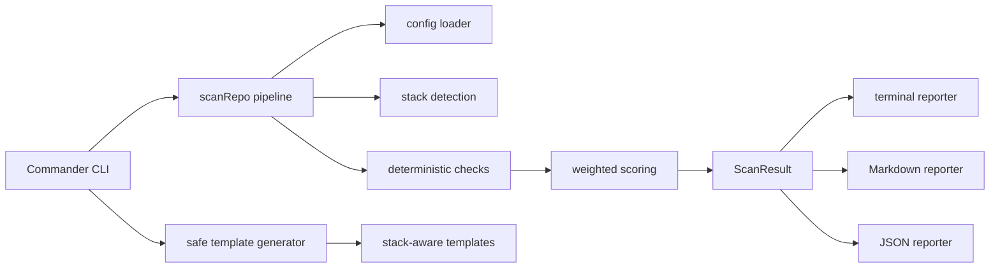

# Repo Doctor AI


Repo Doctor AI is a CLI health scanner that helps developers turn messy repositories into polished, trustworthy open-source projects.

**Scan. Score. Fix. Ship a cleaner GitHub repo.**

```bash
repo-doctor-ai scan
```

```text
Repo Doctor AI

Repository: repo-doctor-ai
Score:      86/100
Stacks:     node (primary)
Summary:    [pass] 31 passed  [warn] 3 warnings  [fail] 2 failed  Critical: 0

Category Scores
Presentation             89/100
Build/Test Readiness     88/100
CI/CD Health             100/100
Security Hygiene         86/100
Contributor Readiness    83/100

Recommended Fixes
1. [fail] medium     Add Dependabot configuration.
2. [fail] low        Add a changelog.
3. [warn] low        Consider adding CodeQL for supported languages.
```

Want the full artifact? See the polished [sample Markdown report](examples/sample-report.md).

## Why It Matters

Repositories are evaluated in minutes. A weak README, missing license, absent CI, no tests, or unclear contribution path can make a useful project feel risky before anyone reaches the code.

Repo Doctor AI gives maintainers a fast, deterministic way to see what a repository communicates to investors, contributors, recruiters, and technical reviewers. It does not require an API key, does not modify source code during scans, and starts with reliable checks before adding optional AI workflows later.

## What It Checks

| Category | Examples |
| --- | --- |
| Presentation | README, badges, license mention, changelog, demo or screenshot section |
| Build/Test Readiness | stack detection, build/test/lint scripts, lockfiles, TypeScript config |
| CI/CD Health | GitHub Actions workflows, push and pull request triggers, checkout, validation commands |
| Security Hygiene | `SECURITY.md`, Dependabot, `.gitignore`, secret-file hygiene, versioned actions |
| Contributor Readiness | contributing guide, code of conduct, PR template, issue templates, roadmap/contact signals |

## Before And After

| Moment | Repo Signal | Score |
| --- | --- | ---: |
| Before | README is thin, no CI, no security policy, missing contributor docs | 37/100 |
| After | Clear README, tests, CI, license, templates, and prioritized fixes | 99/100 |

The point is not vanity scoring. The point is a better first impression backed by concrete, reviewable improvements.

```text
Messy repo
  README: short
  LICENSE: missing
  CI: missing
  Tests: missing
  Security policy: missing
  Score: 37/100

After Repo Doctor AI
  README: install, usage, demo, roadmap
  LICENSE: MIT
  CI: Node 20 + pnpm + lint/test/build
  Tests: present
  Security policy: present
  Score: 99/100
```

## Installation

```bash
pnpm add -g repo-doctor-ai
```

For local development:

```bash
pnpm install
pnpm build
pnpm test
```

Repo Doctor AI targets Node.js 20+ and is built with TypeScript.

## Usage

Scan the current repository:

```bash
repo-doctor-ai scan
```

Scan a specific path:

```bash
repo-doctor-ai scan ./some-project
```

Try the demo fixtures included in this repo:

```bash
repo-doctor-ai scan tests/fixtures/messy-repo
repo-doctor-ai scan tests/fixtures/polished-repo
```

The fixtures are intentionally small: one shows the kind of repo that fails first impressions, and the other shows the same project after adding basic trust signals.

Write a Markdown report:

```bash
repo-doctor-ai scan --format markdown --out repo-doctor-report.md
```

Write a JSON report:

```bash
repo-doctor-ai scan --format json --out repo-doctor-report.json
```

Preview safe templates:

```bash
repo-doctor-ai fix --dry-run
```

Create missing templates:

```bash
repo-doctor-ai fix
```

Overwrite existing generated templates only when you mean it:

```bash
repo-doctor-ai fix --force
```

## Example Report

Generate a report:

```bash
repo-doctor-ai scan tests/fixtures/polished-repo --format markdown --out repo-doctor-report.md
```

Open the maintained sample: [examples/sample-report.md](examples/sample-report.md).

```md
# Repo Doctor AI Report

## Repository

| Field | Value |
| --- | --- |
| Repository | `repo-doctor-ai` |
| Generated | `2026-05-05T03:13:48.922Z` |
| Overall score | **86/100** |

## Top Fixes

1. **FAIL** Add Dependabot configuration.
2. **FAIL** Add a changelog.
3. **WARN** Consider adding CodeQL for supported languages.

## Recommended Next Steps

1. Add `.github/dependabot.yml`.
2. Add `CHANGELOG.md`.
3. Consider a CodeQL workflow for supported languages.
```

## Safe Template Generation

The `fix` command creates missing repository hygiene files and never overwrites existing files unless `--force` is provided.

| Template | Purpose |
| --- | --- |
| `LICENSE` | Establish project usage rights |
| `SECURITY.md` | Give reporters a private vulnerability path |
| `CONTRIBUTING.md` | Explain how to contribute |
| `CHANGELOG.md` | Track notable changes |
| `.github/dependabot.yml` | Keep dependencies fresh |
| `.github/pull_request_template.md` | Improve PR quality |
| `.github/ISSUE_TEMPLATE/*.md` | Standardize bug and feature reports |
| `.github/workflows/ci.yml` | Add stack-aware CI starter workflow |

CI templates are stack-aware for Node, Python, Go, and Rust, with a generic fallback when the stack is unknown.

## Configuration

Repo Doctor AI works without configuration. Add `repo-doctor.config.json` when you want project-specific naming, scoring weights, ignore paths, or generated template metadata.

```json
{
  "projectName": "My Project",
  "license": "MIT",
  "author": "Project Maintainers",
  "ignore": ["dist", "build", "node_modules"],
  "weights": {
    "presentation": 25,
    "buildTest": 25,
    "cicd": 20,
    "security": 20,
    "contributors": 10
  }
}
```

Invalid config files produce clear CLI errors so teams can fix configuration drift quickly.

## Architecture



## Designed For

| User | Why It Helps |
| --- | --- |
| Indie hackers | Prepare public repos before investor or customer demos |
| Open-source maintainers | Find missing trust signals before contributors do |
| Portfolio builders | Make projects easier for reviewers to understand |
| Small teams | Add a lightweight repo hygiene check before launch |
| Technical reviewers | Get a fast snapshot of repository readiness |

## Roadmap

- Broader deterministic checks for package ecosystems
- Richer Markdown report sections and example fixtures
- SARIF export for code scanning workflows
- OpenSSF Scorecard integration
- Optional AI README critique
- GitHub API integration and PR creation
- Organization-wide scan mode

## Contributing

Contributions are welcome. The codebase is intentionally modular:

| Area | Path |
| --- | --- |
| CLI commands | `src/cli.ts` |
| Scan pipeline | `src/scanner/` |
| Reports | `src/reporters/` |
| Templates | `src/templates/` |
| Utilities and config | `src/utils/` |
| Tests | `tests/` |

Good first contributions include new deterministic checks, tighter fixtures, report polish, and stack-specific CI improvements.

## License

MIT. See [LICENSE](LICENSE).
