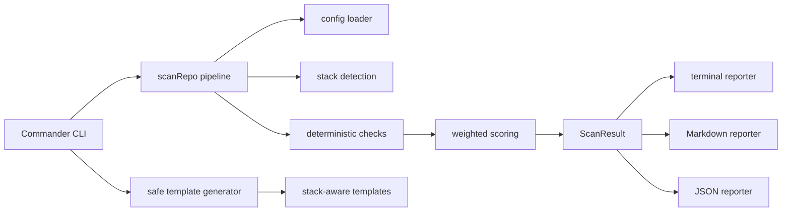

<p align="center">
  
</p>

# Repo Doctor AI


**Repo Doctor AI** is a cross-platform CLI health scanner that helps developers turn messy repositories into polished, trustworthy open-source projects.

**Scan. Score. Fix. Ship a cleaner GitHub repo.**

```bash
repo-doctor-ai scan
```

```text
Repo Doctor AI

Repository: Repo Doctor
Score:      100/100
Stacks:     node (primary)
Summary:    [pass] 36 passed  [warn] 0 warnings  [fail] 0 failed  Critical: 0

Category Scores
Presentation             100/100
Build/Test Readiness     100/100
CI/CD Health             100/100
Security Hygiene         100/100
Contributor Readiness    100/100

Recommended Fixes
No priority fixes found. Nice work.
```

Repo Doctor AI gives developers a fast, local way to understand whether a repository looks ready for contributors, recruiters, investors, customers, and technical reviewers.

No API key required.  
No source-code modification during scans.  
No fake AI magic.  
Just practical repository hygiene checks, scoring, reports, and safe templates.

---

## Why Repo Doctor AI Exists

A repository can have good code and still make a bad first impression.

Common problems:

- Weak or missing `README.md`
- No license
- No CI/CD workflow
- No security policy
- No Dependabot config
- No tests or unclear test scripts
- Missing contributor docs
- No issue or pull request templates
- Poor install and usage instructions
- No clear project positioning

Repo Doctor AI helps maintainers catch those gaps before other people do.

It is built for developers who want their public repos to look serious, usable, and trustworthy.

---

## What It Checks

| Category | What Repo Doctor AI Looks For |
| --- | --- |
| **Presentation** | README, badges, license mention, changelog, demo/screenshot sections |
| **Build/Test Readiness** | stack detection, build/test/lint scripts, lockfiles, TypeScript config |
| **CI/CD Health** | GitHub Actions workflows, push and PR triggers, checkout, validation commands |
| **Security Hygiene** | `SECURITY.md`, Dependabot, `.gitignore`, secret-file hygiene, CodeQL signals |
| **Contributor Readiness** | contributing guide, code of conduct, PR template, issue templates, roadmap/contact signals |

---

## Before And After

| Moment | Repo Signal | Score |
| --- | --- | ---: |
| Before | Thin README, no CI, no security policy, missing contributor docs | 37/100 |
| After | Clear README, tests, CI, license, templates, and prioritized fixes | 99+/100 |

The goal is not vanity scoring. The goal is a better first impression backed by concrete, reviewable improvements.

```text
Messy repo
  README: short
  LICENSE: missing
  CI: missing
  Tests: missing
  Security policy: missing
  Score: 37/100

After Repo Doctor AI
  README: install, usage, demo, roadmap
  LICENSE: MIT
  CI: Node 20 + pnpm + lint/test/build
  Tests: present
  Security policy: present
  Score: 99+/100
```

---

## Installation

Install globally from npm:

```bash
npm install -g repo-doctor-ai
```

Check that it installed correctly:

```bash
repo-doctor-ai --help
```

Repo Doctor AI targets **Node.js 20+**.

---

## Usage

Scan the current repository:

```bash
repo-doctor-ai scan
```

Scan a specific path:

```bash
repo-doctor-ai scan ./some-project
```

Write a Markdown report:

```bash
repo-doctor-ai scan --format markdown --out repo-doctor-report.md
```

Write a JSON report:

```bash
repo-doctor-ai scan --format json --out repo-doctor-report.json
```

Preview safe templates:

```bash
repo-doctor-ai fix --dry-run
```

Create missing templates:

```bash
repo-doctor-ai fix
```

Overwrite existing generated templates only when you mean it:

```bash
repo-doctor-ai fix --force
```

---

## Example CLI Output

```text
Repo Doctor AI

Repository: example-project
Score:      86/100
Stacks:     node (primary)
Summary:    [pass] 31 passed  [warn] 3 warnings  [fail] 2 failed  Critical: 0

Category Scores
Presentation             89/100
Build/Test Readiness     88/100
CI/CD Health             100/100
Security Hygiene         86/100
Contributor Readiness    83/100

Recommended Fixes
1. [fail] medium     Add Dependabot configuration.
2. [fail] low        Add a changelog.
3. [warn] low        Consider adding CodeQL for supported languages.

Notable Findings
[fail] Security Hygiene         No Dependabot configuration was detected.
[fail] Presentation             No changelog was found.
[warn] Security Hygiene         No CodeQL workflow was detected.
```

Want the full artifact? See the polished [sample Markdown report](examples/sample-report.md).

---

## Example Report

Generate a report:

```bash
repo-doctor-ai scan --format markdown --out repo-doctor-report.md
```

Example Markdown output:

```md
# Repo Doctor AI Report

## Repository

| Field | Value |
| --- | --- |
| Repository | `example-project` |
| Generated | `2026-05-05T03:13:48.922Z` |
| Overall score | **86/100** |

## Top Fixes

1. **FAIL** Add Dependabot configuration.
2. **FAIL** Add a changelog.
3. **WARN** Consider adding CodeQL for supported languages.

## Recommended Next Steps

1. Add `.github/dependabot.yml`.
2. Add `CHANGELOG.md`.
3. Consider a CodeQL workflow for supported languages.
```

---

## Safe Template Generation

The `fix` command creates missing repository hygiene files and never overwrites existing files unless `--force` is provided.

| Template | Purpose |
| --- | --- |
| `LICENSE` | Establish project usage rights |
| `SECURITY.md` | Give reporters a private vulnerability path |
| `CONTRIBUTING.md` | Explain how to contribute |
| `CHANGELOG.md` | Track notable changes |
| `.github/dependabot.yml` | Keep dependencies fresh |
| `.github/pull_request_template.md` | Improve PR quality |
| `.github/ISSUE_TEMPLATE/*.md` | Standardize bug and feature reports |
| `.github/workflows/ci.yml` | Add stack-aware CI starter workflow |

CI templates are stack-aware for Node, Python, Go, and Rust, with a generic fallback when the stack is unknown.

---

## Supported Stack Detection

Repo Doctor AI detects common project ecosystems, including:

| Stack | Signals |
| --- | --- |
| Node / JavaScript / TypeScript | `package.json`, lockfiles, `tsconfig.json` |
| Python | `pyproject.toml`, `requirements.txt`, `setup.py` |
| Go | `go.mod`, `go.sum` |
| Rust | `Cargo.toml`, `Cargo.lock` |
| Java | `pom.xml`, `build.gradle` |
| .NET | `.csproj`, `.sln` |
| PHP | `composer.json` |
| Ruby | `Gemfile` |

For Node projects, Repo Doctor AI also checks common scripts such as:

- `test`
- `build`
- `lint`
- `format`
- `typecheck`

---

## Configuration

Repo Doctor AI works without configuration.

Add `repo-doctor.config.json` when you want project-specific naming, scoring weights, ignore paths, or generated template metadata.

```json
{
  "projectName": "My Project",
  "license": "MIT",
  "author": "Project Maintainers",
  "ignore": ["dist", "build", "node_modules"],
  "weights": {
    "presentation": 25,
    "buildTest": 25,
    "cicd": 20,
    "security": 20,
    "contributors": 10
  }
}
```

Invalid config files produce clear CLI errors so teams can fix configuration drift quickly.

---

## Architecture



---

## Designed For

| User | Why It Helps |
| --- | --- |
| Indie hackers | Prepare public repos before investor or customer demos |
| Open-source maintainers | Find missing trust signals before contributors do |
| Portfolio builders | Make projects easier for reviewers to understand |
| Small teams | Add a lightweight repo hygiene check before launch |
| Technical reviewers | Get a fast snapshot of repository readiness |

---

## Local Development

Clone the repo:

```bash
git clone https://github.com/hadnan1994/Repo-Doctor-AI.git
cd Repo-Doctor-AI
```

Install dependencies:

```bash
pnpm install
```

Run the CLI locally:

```bash
pnpm dev scan
```

Run tests:

```bash
pnpm test
```

Run TypeScript validation:

```bash
pnpm lint
```

Build:

```bash
pnpm build
```

Try the demo fixtures:

```bash
repo-doctor-ai scan tests/fixtures/messy-repo
repo-doctor-ai scan tests/fixtures/polished-repo
```

---

## Roadmap

Planned improvements:

- Broader deterministic checks for package ecosystems
- Richer Markdown report sections and example fixtures
- SARIF export for code scanning workflows
- OpenSSF Scorecard integration
- Optional AI README critique
- GitHub API integration and PR creation
- Organization-wide scan mode
- Local LLM support
- VS Code extension

---

## Contributing

Contributions are welcome.

The codebase is intentionally modular:

| Area | Path |
| --- | --- |
| CLI commands | `src/cli.ts` |
| Scan pipeline | `src/scanner/` |
| Reports | `src/reporters/` |
| Templates | `src/templates/` |
| Utilities and config | `src/utils/` |
| Tests | `tests/` |

Good first contributions include:

- New deterministic checks
- Better stack detection
- Report formatting improvements
- Fixture improvements
- Additional CI templates
- Documentation polish

Before opening a pull request, run:

```bash
pnpm lint
pnpm test
pnpm build
```

---

## Project Philosophy

Repo Doctor AI is intentionally practical.

The first version focuses on deterministic checks because developers need reliable feedback, not vague AI-generated guesses.

The tool should remain:

- Local-first
- Safe by default
- Useful without an API key
- Clear in its recommendations
- Easy to extend
- Friendly to open-source contributors

Optional AI features can be added later, but the core should stay dependable.

---

## License

MIT. See [LICENSE](LICENSE).

---

<p align="center">
  Built to help developers ship cleaner, more trustworthy repositories.
</p>